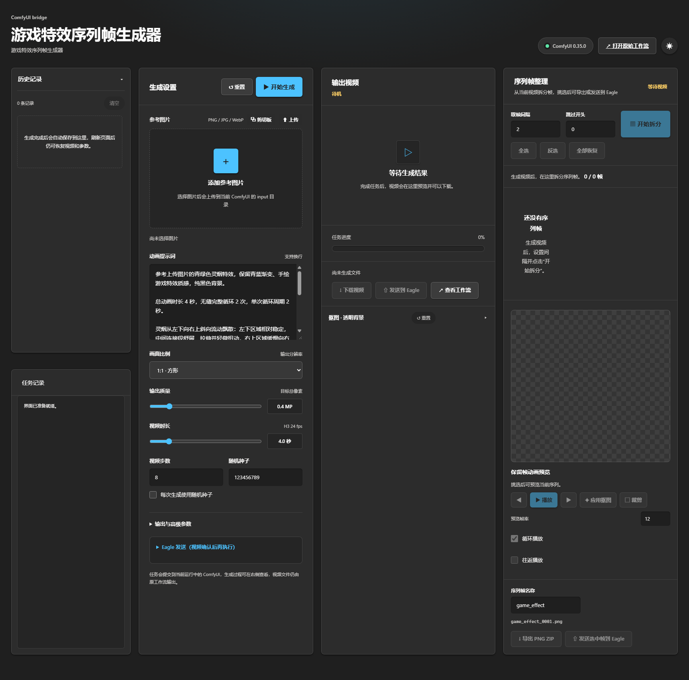

# 游戏特效序列帧生成器

一个跑在 **ComfyUI** 里的**单文件网页前端**：把「选参考图 → 生成特效视频 → 拆序列帧 → 抠背景 → 框选裁剪 → 导出 / 送进 Eagle」这一整串手动操作，收进一个界面里完成。

整个前端就是一个 `web/h3ui.html`——**约 270 KB、零外部依赖、零构建步骤**，不联网、不装 npm。



> 上图是「**流利 · 暗夜**」的完整界面（空状态）；右上角可随时切换亮色 / 暗夜，选择会记住。

---

## 界面里有什么

**四列布局，一屏看完**

| 列 | 内容 |
|---|---|
| 历史记录 | 每次生成都留档，点「恢复」把当时的参数、参考图、输出视频一并还原 |
| 生成设置 | 参考图（可**从剪切板粘贴 / 上传 / 直接拖进来**）、提示词、分辨率、时长、步数、种子；「重置 / 开始生成」在面板头部，不用滚到底 |
| 输出视频 | 视频预览 + 进度 + 下载，**下面就是抠图模块** |
| 序列帧整理 | 取帧间隔 / 跳过开头 → 拆分 → 逐帧取舍 → 动画预览 → **框选裁剪** → 导出 PNG ZIP / 发送到 Eagle |

**流利设计 · 亮/暗两套**

界面固定为「流利设计」，可切换**亮色 / 暗夜**，选择会记住。

**抠图带实时预览**

15 个参数（模式 / 背景色 / 容差 / 羽化 / 去污染 / 距离度量，外加 alpha 增益、伽马、预模糊、边缘平移、反转等高级项）。**拖滑块时预览立刻跟着变**，不用点"应用"再看结果。算法是 `ComfyUI-H3-ImageKey` 的**逐像素 JS 移植**，已和 Python 原版做过 512×512×4 通道的全量比对：**不同字节 0 个，最大偏差 0**。

**框选裁剪（导出用）**

点动画预览那一行的「⬚ 裁剪」，在预览图上**拖一个框**（像截图那样：框外压暗、四角有标记、左下角显示尺寸）。之后导出的 PNG 就是框内那块，**尺寸 = 框的像素尺寸**。框跟着滚轮缩放与拖动平移走，随时可以重画，或点左下角徽标清除；不在裁剪模式时预览照常播放。

**发送到 Eagle 是直连的（不经 ComfyUI 节点）**

点「⇧ 发送选中帧到 Eagle」时，前端**直接调用 Eagle 的本地 API**（默认 `http://127.0.0.1:41595`）：

1. 前端按你的参数出图（抠图 + 裁剪都在浏览器里做完）
2. 把每张 PNG 传到同源 ComfyUI 的 `/upload/image`（临时目录，原样字节、不重编码）
3. 让 Eagle 去抓那个地址并入库

所以 Eagle 里的**条目名字就是你写的「序列帧名称」+ 序号**（例如 `baihu_zhuafeng_0001`；Eagle 只会在后面补 `.png`，**不会加时间戳**），落在你指定的「文件夹」里（不存在会自动新建），并按需带上「标签」。

> 前置条件只有两条：**ComfyUI 在跑**（本页面就是它伺服的）、**Eagle 在跑且开启了 API**（Eagle → 偏好设置 → 开发者）。少任何一个，界面都会明确告诉你，不会静默失败。

**按 Eagle 的操作习惯做了交互**

| 操作 | 行为 |
|---|---|
| `Shift` + 左键 | 从上次点到这次点之间的帧**全部选中**（可连续往外扩） |
| `Ctrl`/`⌘` + 左键 | 只追加 / 取消这一帧 |
| 左键单击 | 翻转这一帧的保留状态；这一帧**被保留**时预览同时跳到它 |
| `←` / `→` | 上一帧 / 下一帧（播放中按会先停播） |
| `空格` | 播放 / 暂停 |
| 滚轮 | 以光标为中心缩放预览（20%–800%），放大后可按住左键拖动平移 |
| 双击预览 / 点右下角百分比 | 回到 100% |
| `Ctrl+A` / `Ctrl+Shift+A` / `Ctrl+I` | 全选 / 取消全选 / 反选 |

所有按键在输入框里都不抢：文本框里 `Ctrl+A` 照样全选文字，数字框里方向键照样调数字。

**其它**：卡片与按钮有统一的 hover 上浮 / 按下缩放（150–200ms），并遵守系统的「减少动态效果」设置；界面所有可见文字都按 WCAG AA 实测过对比度。

---

## 安装

1. 把本仓库**整个目录**放进 `ComfyUI/custom_nodes/`
2. 重启 ComfyUI
3. 打开 `http://127.0.0.1:8188/extensions/<你放进去的目录名>/h3ui.html`

> 目录**叫什么名字，URL 里就是什么**。根目录那个 `__init__.py` 只做一件事：声明 `WEB_DIRECTORY = "./web"`，ComfyUI 就会把 `web/` 挂到 `/extensions/<目录名>/`。删掉整个目录即可完全回退，不影响 ComfyUI 和其它节点。

想开机就自动打开界面的话，可以再配一个"ComfyUI 就绪即自动开窗"的小插件（本仓库只管界面本身，不含启动器）。

> **发送到 Eagle 不需要装任何额外节点** —— 前端直接调 Eagle 的本地 API（见上「发送到 Eagle 是直连的」）。前置条件只有：ComfyUI 在跑、Eagle 在跑且开了 API。

---

## 依赖

### ComfyUI 内置
`LoadImage` `CLIPLoader` `UNETLoader` `VAELoader` `BasicGuider` `SamplerCustomAdvanced` `RandomNoise`
`PrimitiveFloat` `PrimitiveStringMultiline` `ResolutionSelector` `ComfyMathExpression`
（后四个在 `comfy_extras/nodes_primitive.py` / `nodes_resolution.py` / `nodes_math.py`，需要较新的 ComfyUI）

### 需要另装的自定义节点

| 节点 | 来自 | 干什么 |
|---|---|---|
| `MiniMaxH3*` (T8) | [T8mars/comfyui-minimax-h3-audio-T8](https://github.com/T8mars/comfyui-minimax-h3-audio-T8) | 视频生成主体 |
| `VHS_VideoCombine` `VHS_SelectImages` `VHS_SelectEveryNthImage` | [Kosinkadink/ComfyUI-VideoHelperSuite](https://github.com/Kosinkadink/ComfyUI-VideoHelperSuite) | 合成视频；后两个选帧节点只有「在 ComfyUI 原生界面里跑配套工作流」时才用到 |

> **抠图与发送 Eagle 都不需要第三方节点**：抠图是前端内置的 JS 算法；发 Eagle 走 Eagle 自己的本地 API。
> `H3ImageKey` 仍由作者**单独一个仓库**发布 —— [xiaojiangxj33/ComfyUI-H3-ImageKey](https://github.com/xiaojiangxj33/ComfyUI-H3-ImageKey)，
> 那是给「在 ComfyUI 原生界面里跑工作流」用的；**用本前端不需要它**。

配套工作流在 `workflows/` 里，直接在 ComfyUI 里「打开」即可。

### 内置的模型文件名

前端提交用的节点图（连带下面四个模型文件名）是**写死在 `web/h3ui.html` 里**的，界面上没有修改入口：

```
unet_name  : minimax_h3_fl2va_pruned_int8_convrot.safetensors
clip_name  : qwen3vl_32b_minimax_h3_nvfp4_awq.safetensors
vae_name   : minimax_h3_video_vae_fp16.safetensors   ← 视频 VAE
vae_name   : minimax_h3_audio_vae_fp32.safetensors   ← 音频 VAE
```

文件名不一样就搜这四个键（`unet_name` / `clip_name` / `vae_name`）改掉 —— **只改引号里的值，键名别动**。
改错了也不用猜：生成失败的报错会直接点出**哪个节点、哪个字段、以及可选值有哪些**，例如：

```
错误：Prompt outputs failed validation —— 节点 10（UNETLoader）：
      unet_name: '你的模型.safetensors' not in ['minimax_h3_fl2va_pruned_int8_convrot.safetensors'] —— Value not in list
```

---

## 关于抠图

抠图**只有一份实现** —— 前端内置的 JS 算法，它是 `ComfyUI-H3-ImageKey` 的**逐像素移植**
（512×512×4 通道全量比对：**不同字节 0 个，最大偏差 0**）。

| 环节 | 谁在抠 | 需要额外节点吗 |
|---|---|---|
| 界面里的**实时预览**（拖滑块看透明） | 前端 JS | **不需要** |
| **↓ 导出 PNG ZIP** | 前端 JS | **不需要** |
| **⇧ 发送选中帧到 Eagle** | 前端 JS（先把图出好，再交给 Eagle） | **不需要** |

三个出口的判据是同一个 `maskActive()`：只要你在抠图模块里拖过滑块或点过「✦ 应用抠图」，预览、ZIP、Eagle 就都是抠好的；**没碰过抠图模块时就是原始的不透明帧**（导出按钮的悬浮提示会写明这次带不带透明）。

> 裁剪同理：三个出口共用**同一段出图代码**，框选了就都按框来。

---

## 使用流程

### 前置条件

- **ComfyUI 在跑**（本页面就是它伺服的），并且上面「依赖」里的节点装好了
- 要送 Eagle 的话：**Eagle 也在跑**，并且在 **偏好设置 → 开发者** 里**开启了 API**（默认端口 41595）
- 只想导出 PNG 的话，**不需要 Eagle，也不需要任何第三方抠图节点**

### 走一遍

按界面从左到右四列走：

| # | 在哪 | 做什么 |
|---|---|---|
| 1 | 第 2 列「生成设置」→ 参考图片 | 拖一张参考图进拖放区（也可以从「历史记录」点「恢复」直接回到某次结果） |
| 2 | 同上 → 动画提示词 | 写你要的特效；**这段话同时也决定 Eagle 的标签内容** |
| 3 | 同上 → 分辨率 / 时长 / 步数 | 按需调，然后点右上角「**▶ 开始生成**」 |
| 4 | 第 3 列「输出视频」 | 等进度条走完，**先播一遍确认效果**（不满意就改提示词重生成 —— 后面所有步骤都建立在这个视频上） |
| 5 | 第 4 列「序列帧整理」 | 设「取帧间隔」「跳过开头」，点「**开始拆分**」 |
| 6 | 第 4 列 帧网格 | 点帧＝剔除/保留；`Shift`+左键选区间、`Ctrl`+左键单点、`Ctrl+A` 全选…（见上表） |
| 7 | 第 3 列下方 抠图模块 | 拖参数、盯着预览调到满意，点「**✦ 应用抠图**」（在动画预览那一行）。**没点它，Eagle 按钮是禁用的** |
| 8 | 第 4 列 预览控制行 | 只想导出某块画面，就点「**⬚ 裁剪**」在预览图上拖一个框；不拖就是整帧 |
| 9 | 第 4 列 页脚 | 「**↓ 导出 PNG ZIP**」→ 弹出「另存为」让你选保存位置；或「**⇧ 发送选中帧到 Eagle**」直接入库 |

### 两条最常见的路径

- **只要 PNG 序列帧**：1 → 2 → 3 → 4 → 5 → 6 →（可选 8）→ 9 的「导出 PNG ZIP」。
- **直接进 Eagle**：上面全部 + 7（必须先点「应用抠图」）+ 9 的「发送选中帧到 Eagle」；
  名字取自「序列帧名称」+ 四位序号，落在你填的「文件夹」里（不存在会自动新建）。

### 卡住了看这里

| 现象 | 原因 / 怎么办 |
|---|---|
| 「发送到 Eagle」是灰的 | 还没拆帧，或还没点「✦ 应用抠图」——这是**故意的三段式门控**；把鼠标停上去，提示会写清缺哪一步 |
| 日志说「连不上 Eagle」 | Eagle 没开，或没在 偏好设置 → 开发者 里开 API |
| Eagle 里的名字不是我要的 | 名字来自第 4 列页脚的「**序列帧名称**」+ 四位序号；它右边就是实时预览 |
| 导出的图是黑底、不透明 | 说明没点过「应用抠图」＝没抠图。导出按钮的悬浮提示会写明这次带不带透明 |
| 想只导出画面里的一块 | 先用第 8 步的裁剪；导出的**尺寸就是框的像素尺寸** |
| 生成时报 `Value not in list: unet_name ...` | 你的模型文件名和内置的不一致 —— **报错里会列出可选值**，照它改（见上面「内置的模型文件名」） |
| 任务记录看不全 | 日志区可以滚（内容超出时用滚轮），面板本身不会折叠 |

---

## 目录结构

```
.
├── __init__.py     # 只声明 WEB_DIRECTORY，让 ComfyUI 伺服 web/
├── web/
│   └── h3ui.html   # 整个前端（HTML + CSS + JS 全在这一个文件里）
├── workflows/
│   └── H3超极简加速工作流.json
├── docs/
│   └── screenshot.png   # README 里那张界面图（流利 · 暗夜）
└── README.md
```

---

## 说明

- 界面里的提示词模板、示例参数都是可改的默认值，按自己的题材调整即可。
- 仓库里不含任何模型文件、生成结果或本机路径。
- 前端不联网、不加载任何外部资源（`<script src>` / `<link href>` 数量为 0），全部逻辑内联在那一个 HTML 里。
